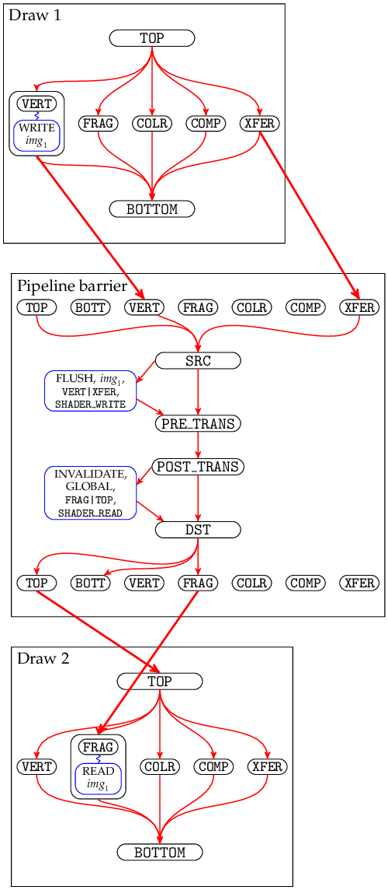

This is an incomplete and almost certainly incorrect attempt to rephrase Vulkan's requirements on execution dependencies in a more precise form.

The basic idea is: Every 'action command' and 'sync command' defines a collection of nodes in a dependency graph, defines some internal edges between those nodes, and defines some external edges between its own nodes and the nodes of other commands. In some cases we define internal nodes that are not strictly necessary but that reduce the number of external edges, making the behaviour easier to understand and visualize. Some sequences of n commands will still result in O(n^2) edges, so these rules should not be implemented literally - implementations may use any approach that gives observably equivalent behaviour.

The goal is to specify the rules in a pseudo-mathematical way so that they're unambiguous (albeit not necessarily intuitive) for human readers, and so that an algorithm (e.g. implemented in a Vulkan layer) could follow the rules to detect race conditions and (ideally) to render a visualization so the human gets some idea of what they've done wrong.

The (still unfinished) definition has ended up being quite verbose. To hopefully to make it a bit easier to follow, we can draw some diagrams to illustrate parts of the dependency graph. The internal nodes and edges in action commands and pipeline barriers should look like:

 

(Some of the pipeline stages are omitted from these diagrams, for clarity.)

Pipeline barriers create external edges from a stage in a previous action command to the corresponding source stage in the pipeline barrier, and from a destination stage in the pipeline barrier to the corresponding stage in a subsequent action command.

E.g.
```cpp
vkCmdDraw(...);
vkCmdPipelineBarrier(...,
    VK_PIPELINE_STAGE_VERTEX_SHADER_BIT | VK_PIPELINE_STAGE_TRANSFER_BIT,
    VK_PIPELINE_STAGE_TOP_OF_PIPE_BIT,
    ...
);
vkCmdDraw(...);
```
creates an execution dependency graph like:


in which you can follow the arrows to see an execution dependency chain from e.g. draw 1's `VERTEX_SHADER` stage to draw 2's `TRANSFER` stage, meaning draw 1's `VERTEX_SHADER` must complete before draw 2's `TRANSFER` can start. However there is no execution dependency chain from draw 1's `FRAGMENT_SHADER` stage to any stage in draw 2, meaning the `FRAGMENT_SHADER` can run after or concurrently with any of draw 2's stages.

TODO: More diagrams, for events and subpasses and everything else.

### Definitions

First we need to define a few terms.

An "execution dependency order" is a partial order over elements of the following types:
* (action command, stage)
* (sync command, SRC or DST, stage)
* (sync command, SRC or DST or POST_TRANS or PRE_TRANS)
* (command buffer, SUBMIT or COMPLETE)
* (subpass, SRC or DST, stage)
* subpass dependency
* layout transition

Actions commands are:
* vkCmdDraw (+Indirect, +Indexed)
* vkCmdDispatch (+Indirect)
* Transfer operations:
  * vkCmdCopy*
  * vkCmdClear*
  * vkCmdBlitImage
  * vkCmdUpdateBuffer
  * vkCmdFillBuffer
* vkCmdWriteTimestamp
* vkCmdResolveImage ???
* Other query stuff ???

Sync commands are:
* vkCmdPipelineBarrier
* vkCmdSetEvent
* vkCmdWaitEvents
* vkSetEvent, vkResetEvent ???

By "command" we really mean a single execution of a command. A command might be recorded once but its command buffer might be submitted many times, and each time will count as a separate execution with its own separate position in the ordering.

*extractStages(mask)* converts a bitmask into a set of stages:
* If *mask* & `TOP_OF_PIPE_BIT`, add `TOP_OF_PIPE` into the set.
* If *mask* & `DRAW_INDIRECT_BIT`, add `DRAW_INDIRECT` into the set.
* ...
* If *mask* & `ALL_GRAPHICS_BIT`, add `DRAW_INDIRECT`, ..., `COLOR_ATTACHMENT_OUTPUT` into the set.
* If *mask* & `ALL_COMMANDS_BIT`, add `DRAW_INDIRECT`, ..., `COLOR_ATTACHMENT_OUTPUT`, `COMPUTE_SHADER`, `TRANSFER` into the set.

We define "command order" as follows:
* Commands executed in command buffer submission *A* are considered earlier than commands executed in command buffer submission *B*, where *A* and *B* were submitted to the same queue and *A* was submitted first.
* Commands executed in a single command buffer submission are ordered in the same order that they were recorded in that command buffer. Secondary command buffers are 'inlined' into their primary command buffers for the purpose of defining this order.

### Execution dependency order

We define the execution dependency order '<' as follows:

* For every `vkCmdPipelineBarrier` *barrier* that does not have `BY_REGION_BIT`:
  * If the barrier is not inside a render pass:
    * Let *A_a* be the set of all action commands preceding *barrier* in the current queue, in command order.
    * Let *A_s* be the set of all sync   commands preceding *barrier* in the current queue, in command order.
    * Let *B_a* be the set of all action commands following *barrier* in the current queue, in command order.
    * Let *B_s* be the set of all sync   commands following *barrier* in the current queue, in command order.
  * If the barrier is inside a render pass:
    * Let *A_a* be the set of all action commands preceding *barrier* in the current subpass, in command order.
    * Let *A_s* be the set of all sync   commands preceding *barrier* in the current subpass, in command order.
    * Let *B_a* be the set of all action commands following *barrier* in the current subpass, in command order.
    * Let *B_s* be the set of all sync   commands following *barrier* in the current subpass, in command order.
  * For every *a* in *A_a*, and every *srcStage* in *extractStages(barrier.srcStageMask)*:
    * (*a*, *srcStage*) < (*barrier*, SRC, *srcStage*)
  * For every *a* in *A_s*, and every *srcStage* in *extractStages(barrier.srcStageMask)*:
    * (*a*, DST, *srcStage*) < (*barrier*, SRC, *srcStage*)
  * For every *srcStage* in *extractStages(barrier.srcStageMask)*:
    * (*barrier*, SRC, *srcStage*) < (*barrier*, SRC)
  * (*barrier*, SRC) < (*barrier*, PRE_TRANS) < (*barrier*, POST_TRANS) < (*barrier*, DST)
  * For every *dstStage* in *extractStages(barrier.dstStageMask)*:
    * (*barrier*, DST) < (*barrier*, DST, *dstStage*)
  * For every *b* in *B_a*, and every *dstStage* in *extractStages(barrier.dstStageMask)*:
    * (*barrier*, *dstStage*) < (*b*, *dstStage*)
  * For every *b* in *B_s*, and every *dstStage* in *extractStages(barrier.dstStageMask)*:
    * (*barrier*, *dstStage*) < (*b*, SRC, *dstStage*)

  * Let *M_{transition}* be the set of all `VkImageMemoryBarrier` *imgMemBarrier* in *barrier*, where *imgMemBarrier.oldLayout* != *imgMemBarrier.newLayout*.
  * For every *transition* in *M_{transition}*:
    * (*barrier*, PRE_TRANS) < *transition* < (*barrier*, POST_TRANS)

---

**NOTE**: This is defining that a pipeline barrier looks like:


There are sets of source stages and destination stages. The stages included in `srcStageMask`/`dstStageMask` are connected to the barrier's internal SRC/DST. Image layout transitions happen in the middle of the pipeline barrier.

The active source stages are connected to the corresponding stages of earlier commands (either all earlier commands, or (if the barrier is inside a subpass) earlier commands in the current subpass). The active destination stages are connected similarly to following commands. This means you can construct a chain of execution dependencies through multiple pipeline barriers, as long as they have the appropriate bits set in `srcStageMask`/`dstStageMask` to make the connection.

---

* For every `vkCmdWaitEvents` *waitEvents*:
  * Let *B_a* be the set of all action commands following *waitEvents* in the current queue, in command order.
  * Let *B_s* be the set of all sync commands following *waitEvents* in the current queue, in command order.
  * (*waitEvents*, SRC) < (*waitEvents*, PRE_TRANS) < (*waitEvents*, POST_TRANS) < (*waitEvents*, DST)
  * For every *dstStage* in *extractStages(waitEvents.dstStageMask)*:
    * (*waitEvents*, DST) < (*waitEvents*, DST, *dstStage*)
  * For every *b* in *B_a*, and every *dstStage* in *extractStages(waitEvents.dstStageMask)*:
    * (*waitEvents*, DST, *dstStage*) < (*b*, *dstStage*)
  * For every *b* in *B_s*, and every *dstStage* in *extractStages(waitEvents.dstStageMask)*:
    * (*waitEvents*, DST, *dstStage*) < (*b*, SRC, *dstStage*)

  * Let *M_{transition}* be the set of all `VkImageMemoryBarrier` *imgMemBarrier* in *waitEvents*, where *imgMemBarrier.oldLayout* != *imgMemBarrier.newLayout*.
  * For every *transition* in *M_{transition}*:
    * (*waitEvents*, PRE_TRANS) < *transition* < (*waitEvents*, POST_TRANS)

* For every `vkCmdSetEvent` *setEvent* on some event object *event*:
  * Let *W* be the set of `vkCmdWaitEvents` commands, such that for each *waitEvents* in *W*:
    * *event* is included in *waitEvents*'s array of event objects to wait on.
    * *waitEvents* follows *setEvent* in command order.
    * There is no `vkCmdResetEvent` on *event* that is between *setEvent* and *waitEvents* in command order.
  * Let *A* be the set of all action commands and barrier commands preceding *setEvent* in the current queue, in command order.
  * For every *a* in *A*, and every *stage* in *extractStages(setEvent.stageMask)*:
    * (*a*, *stage*) < (*setEvent*, SRC, *stage*)
  * For every *stage* in *extractStages(setEvent.stageMask)*:
    * (*setEvent*, SRC, *stage*) < (*setEvent*, SRC)
  * For every *waitEvents* in *W*:
    * (*setEvent*, SRC) < (*waitEvents*, SRC)

* TODO: vkSetEvent from host

---

**NOTE**: A pair of `vkCmdSetEvent` and `vkCmdWaitEvents` is very similar to a `vkCmdPipelineBarrier` split in half.

---

* For all action commands *c*:
  * For all stages *stage* (not including `TOP` or `BOTTOM`):
    * (*c*, `TOP`) < (*c*, *stage*) < (*c*, `BOTTOM`)

---

**NOTE**: This is defining that an action command looks like:


i.e. a bunch of stages between `TOP` and `BOTTOM`. Action commands will not do work in all of these stages.

---

* For all action commands *c*:
  * Let *cmdBuf* be the primary command buffer containing *c*.
  * (*cmdBuf*, SUBMIT) < (*c*, `TOP`)
  * (*c*, `BOTTOM`) < (*cmdBuf*, COMPLETE)

* For all sync commands *c* inside a command buffer:
  * Let *cmdBuf* be the primary command buffer containing *c*.
  * (*cmdBuf*, SUBMIT) < (*c*, SRC)
  * (*c*, DST) < (*cmdBuf*, COMPLETE)

---

**NOTE**: This is saying that commands can't start before their corresponding command buffer, and the command buffer won't be considered complete until all its commands are complete.

This is defined in terms of primary command buffers. For commands in secondary command buffers, it'll use the primary command buffer that executes that secondary command buffer.

---

* For every subpass *subpass*:
  * For every stage *stage*:
    * (*subpass*, SRC, *stage*) < (*subpass*, DST, *stage*)
    * For every action command *c* in *subpass*:
      * (*subpass*, SRC, *stage*) < (*c*, *stage*) < (*subpass*, DST, *stage*)
    * For every sync command *c* in *subpass*:
      * (*subpass*, SRC, *stage*) < (*c*, SRC, *stage*)
      * (*c*, DST, *stage*) < (*subpass*, DST, *stage*)

* For every `VkSubpassDependency` *subpassDep* that does not have `BY_REGION_BIT`:
  * If *subpassDep.srcSubpass* = *subpassDep.dstSubpass*:
    * They must not both be equal to `VK_SUBPASS_EXTERNAL`.
    * This is a subpass self-dependency. The subpass can contain `vkCmdPipelineBarrier` commands (subject to certain validity requirements not described here), which create execution dependencies as described above.
  * Otherwise:
    * If *subpassDep.srcSubpass* is `VK_SUBPASS_EXTERNAL`:
      * Let *A_a* be the set of all action commands preceding the current render pass, in command order.
      * Let *A_s* be the set of all sync commands preceding the current render pass, in command order.
      * For every *a* in *A_a*, and every *srcStage* in *extractStages(subpassDep.srcStageMask)*:
        * (*a*, *srcStage*) < *subpassDep*
      * For every *a* in *A_s*, and every *srcStage* in *extractStages(subpassDep.srcStageMask)*:
        * (*a*, DST, *srcStage*) < *subpassDep*
    * Otherwise:
      * For every *srcStage* in *extractStages(subpassDep.srcStageMask)*:
        * (*subpassDep.srcSubpass*, DST, *srcStage*) < *subpassDep*

    * If *subpassDep.dstcSubpass* is `VK_SUBPASS_EXTERNAL`:
      * Let *B_a* be the set of all action commands following the current render pass, in command order.
      * Let *B_s* be the set of all sync commands following the current render pass, in command order.
      * For every *b* in *B_a*, and every *dstStage* in *extractStages(subpassDep.dstStageMask)*:
        * *subpassDep* < (*b*, *dstStage*)
      * For every *b* in *B_s*, and every *dstStage* in *extractStages(subpassDep.dstStageMask)*:
        * *subpassDep* < (*b*, SRC, *dstStage*)
    * Otherwise:
      * For every *dstStage* in *extractStages(subpassDep.dstStageMask)*:
        * *subpassDep* < (*subpassDep.dstSubpass*, SRC, *dstStage*)

---

**NOTE**: The definition of subpass SRC/DST stages is necessary because we might have execution dependency chains passing through a subpass which contains no commands. The SRC/DST stages give something for the dependency to be ordered relative to.

---

* Transitivity: If *X* < *Y* and *Y* < *Z*, then *X* < *Z*.

We also define the by-region execution dependency order '<\_{region}' as follows:
* For every `vkCmdPipelineBarrier` *barrier* that has `BY_REGION_BIT`:
  * ... similar to the definition above ...
* For every `VkSubpassDependency` *subpassDep* that has `BY_REGION_BIT`:
  * ... similar to the definition above ...
* Transitivity: If *X* <\_{region} *Y* and *Y* <\_{region} *Z*, then *X* <\_{region} *Z*.
* If *X* < *Y*, then *X* <\_{region} *Y*.

We need some validity requirements for the event execution dependencies to make sense:

* If there are two `vkCmdSetEvent` *set_1* and *set_2* on the same event, and neither *set_1* < *set_2* nor *set_2* < *set_1*, then behaviour is undefined.
* If there is a `vkCmdSetEvent` and a `vkCmdWaitEvents` on the same event, and neither *set* < *wait* nor *wait* < *set*, then behaviour is undefined.
* If there is a `vkCmdSetEvent` and a `vkCmdResetEvent` on the same event, and neither *set* < *reset* nor *reset* < *set*, then behaviour is undefined.
* If there is a `vkCmdResetEvent` and a `vkCmdWaitEvents` on the same event, and neither *reset* < *wait* nor *wait* < *reset*, then behaviour is undefined.

i.e. you must not have race conditions between two commands on the same event when the behaviour depends on the order they execute in. (TODO: These are somewhat stricter than the current spec requires. Maybe it needs to be defined differently, so we allow multiple valid execution orders instead of simply saying it's undefined if there's more than one valid order.)

Finally we can say:

* If *X* < *Y*, then the implementation must complete the work performed by *X* before starting the work performed by *Y*.
* If *X* <\_{region} *Y*, then for every region (x,y,layer) in the framebuffer (or viewport or something?), the implementation must complete the work performed by *X* for that region, before starting the work performed by *Y* for that region.
* In all other cases, the implementation may reorder and overlap work however it wishes.

(TODO: define what "completion" actually means)

Note that '<' is defined so that execution dependencies always go in the same direction as command order. (...unless there are bugs in the definition). That means an implementation could simply execute every command in command order, with no pipelining and no reordering, and would satisfy all the requirements above. Or it could choose to insert arbitrary sync points at which every previous command completes before any subsequent command starts, for example at the start/end of a command buffer, to limit the scope in which it has to track parallelism.

### Memory dependencies

The concept we use for memory dependencies is that a device will have many internal caches - in the worst case a separate cache for every different access type in every pipeline stage. Cached writes must be flushed to main memory to make them available to other stages. Similarly caches must be invalidated before reading recently-written data through them, to make the changes in main memory visible to that stage, preventing it reading stale data from the cache; and must also be invalidated before writing near recently-written data, since a partial cache line write will essentially perform a read and we again need to avoid using stale data. No memory dependencies are needed for read-after-read and write-after-read.

(Implementations are not expected to literally use caches like this - e.g. if two stages have a shared cache then they could optimise away a flush/invalidate pair between those stages, or they could flush from independent L1 caches into a shared L2 cache instead of into main memory, or they might buffer memory accesses in something quite different to a data cache, etc. They just need to make sure the observable behaviour is compatible with the what's described here, so that application developers can ignore those details and assume it's simple caches.)

(NOTE: I'm using the terms "flush" and "invalidate" instead of "make available" and "make visible", even though they're slightly more low-level than intended, because they're much more conventional terms and I find it much easier to remember which way round they go, and because they're easier to use in sentences.)

We define four new groups of elements:
* (READ, *c*, *stage*, *access*, *mem*)
* (WRITE, *c*, *stage*, *access*, *mem*)
* (FLUSH, *b*, *stage*, *access*, *mem*)
* (INVALIDATE, *b*, *stage*, *access*, *mem*)

*mem* is either a range of a `VkDeviceMemory`, or an image subresource, or the special value "GLOBAL" (only used in FLUSH/INVALIDATE). *access* is one of `VkAccessFlagBits`. *stage* is one of `VkPipelineStageFlags`. *c* is an action command. *b* is a barrier command or (TODO: other things that create memory dependencies).

*memOverlap(mem_1, mem_2)* is the set of memory locations in the intersection between the two memory ranges, as defined by the current spec for memory aliasing. (TODO: might need to be more specific about cache line granularity for buffer accesses). If one is GLOBAL then the intersection is the other one.

*memIsSubset(mem_1, mem_2)* is true if (and only if) *mem_2* is 'larger' than (or equal to) *mem_1*. That means either *mem_2* is GLOBAL, or is a larger range of the same `VkBuffer`, or is a larger image subresource range. (*memIsSubset* ignores aliasing.)

These elements all participate in the execution dependency order '<', extending the definition of '<' above.

Most READ and WRITE operations happen inside one of the stages of an action command. To represent them happening at the same time as a (*c*, *stage*), we define an equivalence relation '~' which means the READ/WRITE adopts the same position in execution dependency order as their corresponding command:

* If *X* ~ *Y* and *X* < *Z* then *Y* < *Z*.
* If *X* ~ *Y* and *Z* < *X* then *Z* < *Y*.

We need to define every possible memory access from every command:

* For all transfer commands *c*:
  * (*c*, `TRANSFER`) ~ (READ, *c*, `TRANSFER`, `ACCESS_TRANSFER_READ`, whatever the source is)
  * (*c*, `TRANSFER`) ~ (WRITE, *c*, `TRANSFER`, `ACCESS_TRANSFER_WRITE`, whatever the destination is)
* For all vkCmdDispatch (+Indirect) commands *c*:
  * (*c*, `COMPUTE`) ~ (READ, *c*, `COMPUTE`, `ACCESS_SHADER_READ`, whatever the source is) for each thing the compute shader reads
  * (*c*, `COMPUTE`) ~ (WRITE, *c*, `COMPUTE`, `ACCESS_SHADER_WRITE`, whatever the destination is) for each thing the compute shader writes
  * (*c*, `COMPUTE`) ~ (READ, *c*, `COMPUTE`, `UNIFORM_SHADER_READ`, whatever the source is) for each uniform thing the compute shader reads
  * etc
* For all vkCmdDraw (+Indirect, +Indexed) commands *c*:
  * ... loads of stuff depending on the pipeline state etc
* For all vkCmd{Dispatch,Draw}Indirect commands *c*:
  * (*c*, `DRAW_INDIRECT`) ~ (READ, *c*, `DRAW_INDIRECT`, `ACCESS_INDIRECT_COMMAND_READ`, whatever the source is)
* TODO: layout transitions sort of read/write
* TODO: what about stuff like automatic clears in render passes?
* TODO: host accesses

FLUSH and INVALIDATE are created by memory barriers:

* For every `vkCmdPipelineBarrier` *barrier*:
  * For every *memoryBarrier* in *barrier.pMemoryBarriers*:
    * For every *srcAccess* in *memoryBarrier.srcAccessMask*, and every *srcStage* in *extractStages(barrier.srcStageMask)*:
      * (*barrier*, SRC) < (FLUSH, *barrier*, *srcStage*, *srcAccess*, GLOBAL) < (*barrier*, PRE_TRANS)
    * For every *dstAccess* in *memoryBarrier.dstAccessMask*, and every *dstStage* in *extractStages(barrier.dstStageMask)*:
      * (*barrier*, POST_TRANS) < (INVALIDATE, *barrier*, *dstStage*, *dstAccess*, GLOBAL) < (*barrier*, DST)
  * For every *bufferMemoryBarrier* in *barrier.pBufferMemoryBarriers*:
    * ... similar but with a buffer range instead of GLOBAL
  * For every *imageMemoryBarrier* in *barrier.pImageMemoryBarriers*:
    * ... similar but with an image subresource instead of GLOBAL
* TODO: all the other ways of defining explicit and implicit memory barriers

If we modify the earlier example to include some memory barriers like:
```cpp
vkCmdDraw(...);
vkCmdPipelineBarrier(...,
    VK_PIPELINE_STAGE_VERTEX_SHADER_BIT | VK_PIPELINE_STAGE_TRANSFER_BIT,
    VK_PIPELINE_STAGE_FRAGMENT_SHADER_BIT | VK_PIPELINE_STAGE_TOP_OF_PIPE_BIT,
    pMemoryBarriers = { {
        srcAccessMask = 0,
        dstAccessMask = VK_ACCESS_SHADER_READ_BIT
    } },
    pImageMemoryBarriers = { {
        srcAccessMask = VK_ACCESS_SHADER_WRITE_BIT,
        dstAccessMask = 0,
        image = ...,
        subresourceRange = ...
    } },
    ...
);
vkCmdDraw(...);
```
then we can illustrate it like:



Here draw 1's `VERTEX_SHADER` stage is writing to some image subresource *img_1*, draw 2's `FRAGMENT_SHADER` is reading from *img_1*, and the pipeline barrier is doing a flush of *img_1* and a GLOBAL invalidate which both include the appropriate access types and stages that correspond to the WRITE/READ.

Having defined these operations, we can now define the rules that applications must follow. Violating these rules will result in unpredictable reads from memory.

Race conditions between writes and other read/write accesses are not permitted, because they would result in unpredictable behaviour depending on the scheduling of the commands:

* For every *write* = (WRITE, *c_1*, *stage_1*, *access_1*, *mem_1*), *read* = (READ, *c_2*, *stage_2*, *access_2*, *mem_2*) such that *memOverlap(mem_1, mem_2)* is not empty:
  * The application must ensure either *write* < *read*, or *read* < *write*. (Note this is equivalent to requiring either (*c_1*, *stage_1*) < (*c_2*, *stage_2*) or vice versa, due to the equivalence between WRITEs/READs and command stages.)
* For every *write_1* = (WRITE, *c_1*, *stage_1*, *access_1*, *mem_1*), *write_2* = (WRITE, *c_2*, *stage_2*, *access_2*, *mem_2*) such that *write_1* != *write_2*, and *memOverlap(mem_1, mem_2)* is not empty:
  * The application must ensure either *write_1* < *write_2*, or *write_2* < *write_1*.

Between a write and a subsequent memory access, the memory must be flushed and invalidated:

* If there exist *write* = (WRITE, *c_1*, *stage_1*, *access_1*, *mem_1*), *read* = (READ, *c_2*, *stage_2*, *access_2*, *mem_2*) such that *write* < *read*, and *mem* = *memOverlap(mem_1, mem_2)* is not empty:
  * There must be some *flush* = (FLUSH, *b_1*, *stage_1*, *access_1*, *mem_1b*), *invalidate* = (INVALIDATE, *b_2*, *stage_2*, *access_2*, *mem_2b*) such that *write* < *flush* < *invalidate* < *read*, and *memIsSubset(mem, mem_1b)* and *memIsSubset(mem, mem_2b)*.
  * (This is saying that for every region of memory that is both written by one stage and read by another stage, you must first flush at least that much (possibly more) and invalidate that much (possibly more) between the write and read.)
* If there exist *write_1* = (WRITE, *c_1*, *stage_1*, *access_1*, *mem_1*), *write_2* = (WRITE, *c_2*, *stage_2*, *access_2*, *mem_2*) such that *write_1* < *write_2*, and *mem* = *memOverlap(mem_1, mem_2)* is not empty:
  * There must be some *flush* = (FLUSH, *b_1*, *stage_1*, *access_1*, *mem_1b*), *invalidate* = (INVALIDATE, *b_2*, *stage_2*, *access_2*, *mem_2b*) such that *write_1* < *flush* < *invalidate* < *write_2*, and *memIsSubset(mem, mem_1b)* and *memIsSubset(mem, mem_2b)*.

Additionally, you mustn't invalidate dirty memory (because that would leave the contents of RAM unpredictable, depending on whether the dirty lines were partially written back or not) - you must flush it first. This applies even when the invalidate is a different stage or access type, because some implementations might share caches between stages and access types and so the invalidate will still touch the dirty cache lines:

* If there exist *write* = (WRITE, *c_1*, *stage_1*, *access_1*, *mem_1*), *invalidate* = (INVALIDATE, *b_2*, *stage_2*, *access_2*, *mem_2*) such that *write* < *invalidate*, and *mem* = *memOverlap(mem_1, mem_2)* is not empty:
  * There must be some *flush* = (FLUSH, *b_1*, *stage_1*, *access_1*, *mem_1b*) such that *write* < *flush* < *invalidate*, and *memIsSubset(mem, mem_1b)* and *memIsSubset(mem, mem_2)*

And there must not be any race conditions between writes and invalidates, for the same reason:

* For every *write* = (WRITE, *c_1*, *stage_1*, *access_1*, *mem_1*), *invalidate* = (INVALIDATE, *b_2*, *stage_2*, *access_2*, *mem_2*) such that *memOverlap(mem_1, mem_2)* is not empty:
  * The application must ensure either *write* < *invalidate*, or *invalidate* < *write*.

(On the other hand, race conditions between writes and flushes are no problem.)

TODO: by-region memory dependencies.

TODO: cases where a stage in a command can be coherent with itself (Coherent in shaders, color attachment reads/writes, etc).


### TODO

Transitions: The spec says:

> Layout transitions that are performed via image memory barriers are automatically ordered against other layout transitions, including those that occur as part of a render pass instance.

but I have no idea what that even means?

Fences

Semaphores

Host events

Host accesses

QueueSubmit guarantees

Semaphores, fences, events: be clear about how they're referring to the object at the time the command is executed (it might get deleted later)

...
