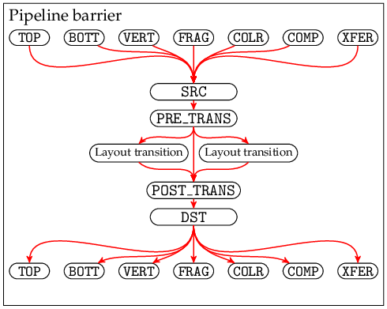

This is an incomplete and almost certainly incorrect attempt to rephrase Vulkan's requirements on execution dependencies in a more precise form.

The basic idea is: Every 'action command' and 'sync command' defines a collection of nodes in a dependency graph, defines some internal edges between those nodes, and defines some external edges between its own nodes and the nodes of other commands. In some cases we define internal nodes that are not strictly necessary but that reduce the number of external edges, making the behaviour easier to understand and visualize. Some sequences of n commands will still result in O(n^2) edges, so these rules should not be implemented literally - implementations may use any approach that gives observably equivalent behaviour.

The goal is to specify the rules in a pseudo-mathematical way so that they're unambiguous (albeit not necessarily intuitive) for human readers, and so that an algorithm (e.g. implemented in a Vulkan layer) could follow the rules to detect race conditions and (ideally) to render a visualization so the human gets some idea of what they've done wrong.

The (still unfinished) definition has ended up being quite verbose. To hopefully to make it a bit easier to follow, we can draw some diagrams to illustrate parts of the dependency graph. The internal nodes and edges in action commands and pipeline barriers should look like:

 

(Some of the pipeline stages are omitted from these diagrams, for clarity.)

Pipeline barriers create external edges from a stage in a previous action command to the corresponding source stage in the pipeline barrier, and from a destination stage in the pipeline barrier to the corresponding stage in a subsequent action command.

E.g.
```cpp
vkCmdDraw(...);
vkCmdPipelineBarrier(...,
    VK_PIPELINE_STAGE_VERTEX_SHADER_BIT | VK_PIPELINE_STAGE_TRANSFER_BIT,
    VK_PIPELINE_STAGE_TOP_OF_PIPE_BIT,
    ...
);
vkCmdDraw(...);
```
creates an execution dependency graph like:


in which you can follow the arrows to see an execution dependency chain from e.g. draw 1's `VERTEX_SHADER` stage to draw 2's `TRANSFER` stage, meaning draw 1's `VERTEX_SHADER` must complete before draw 2's `TRANSFER` can start. However there is no execution dependency chain from draw 1's `FRAGMENT_SHADER` stage to any stage in draw 2, meaning the `FRAGMENT_SHADER` can run after or concurrently with any of draw 2's stages.

TODO: More diagrams, for events and subpasses and everything else.

### Definitions

First we need to define a few terms.

An "execution dependency order" is a partial order over elements of the following types:
* (action command, stage)
* (sync command, SRC or DST, stage)
* (sync command, SRC or DST)
* layout transition
* opaque identifier used for subpass dependencies
* submission of a command buffer
* completion of a command buffer

Actions commands are:
* vkCmdDraw (+Indirect, +Indexed)
* vkCmdDispatch (+Indirect)
* Transfer operations:
  * vkCmdCopy*
  * vkCmdClear*
  * vkCmdBlitImage
  * vkCmdUpdateBuffer
  * vkCmdFillBuffer
* vkCmdWriteTimestamp
* vkCmdResolveImage ???
* Other query stuff ???

Sync commands are:
* vkCmdPipelineBarrier
* vkCmdSetEvent
* vkCmdWaitEvents
* vkSetEvent, vkResetEvent ???

By "command" we usually mean a specific submission or execution of a command. A command might be recorded once but its command buffer might be submitted many times, and each time will count as a separate submission/execution with its own position in the ordering. (TODO: clean up this terminology.)

*extractStages(mask)* converts a bitmask into a set of stages:
* If *mask* & `TOP_OF_PIPE_BIT`, add `TOP_OF_PIPE` into the set.
* If *mask* & `DRAW_INDIRECT_BIT`, add `DRAW_INDIRECT` into the set.
* ...
* If *mask* & `ALL_GRAPHICS_BIT`, add `DRAW_INDIRECT`, ..., `COLOR_ATTACHMENT_OUTPUT` into the set.
* If *mask* & `ALL_COMMANDS_BIT`, add `DRAW_INDIRECT`, ..., `COLOR_ATTACHMENT_OUTPUT`, `COMPUTE_SHADER`, `TRANSFER` into the set.

We define "command order" as follows:
* Commands executed in command buffer submission *A* are considered earlier than commands executed in command buffer submission *B*, where *A* and *B* were submitted to the same queue and *A* was submitted first.
* Commands executed in a single command buffer submission are ordered in the same order that they were recorded in that command buffer. Secondary command buffers are 'inlined' into their primary command buffers for the purpose of defining this order.

### Execution dependency order

We define the execution dependency order '<' as follows:

* For every `vkCmdPipelineBarrier` *barrier* that does not have `BY_REGION_BIT`:
  * If the barrier is not inside a render pass:
    * Let *A_a* be the set of all action commands preceding *barrier* in the current queue, in command order.
    * Let *A_s* be the set of all sync commands preceding *barrier* in the current queue, in command order.
    * Let *B_a* be the set of all action commands following *barrier* in the current queue, in command order.
    * Let *B_s* be the set of all sync commands following *barrier* in the current queue, in command order.
  * If the barrier is inside a render pass:
    * Let *A_a* be the set of all action commands preceding *barrier* in the current subpass, in command order.
    * Let *A_s* be the set of all sync commands preceding *barrier* in the current subpass, in command order.
    * Let *B_a* be the set of all action commands following *barrier* in the current subpass, in command order.
    * Let *B_s* be the set of all sync commands following *barrier* in the current subpass, in command order.
  * For every *a* in *A_a*, and every *srcStage* in *extractStages(barrier.srcStageMask)*:
    * (*a*, *srcStage*) < (*barrier*, SRC, *srcStage*)
  * For every *a* in *A_s*, and every *srcStage* in *extractStages(barrier.srcStageMask)*:
    * (*a*, DST, *srcStage*) < (*barrier*, SRC, *srcStage*)
  * For every *srcStage* in *extractStages(barrier.srcStageMask)*:
    * (*barrier*, SRC, *srcStage*) < (*barrier*, SRC)
  * (*barrier*, SRC) < (*barrier*, DST)
  * For every *dstStage* in *extractStages(barrier.dstStageMask)*:
    * (*barrier*, DST) < (*barrier*, DST, *dstStage*)
  * For every *b* in *B_a*, and every *dstStage* in *extractStages(barrier.dstStageMask)*:
    * (*barrier*, *dstStage*) < (*b*, *dstStage*)
  * For every *b* in *B_s*, and every *dstStage* in *extractStages(barrier.dstStageMask)*:
    * (*barrier*, *dstStage*) < (*b*, SRC, *dstStage*)

  * Let *M_{transition}* be the set of all `VkImageMemoryBarrier` *imgMemBarrier* in *barrier*, where *imgMemBarrier.oldLayout* != *imgMemBarrier.newLayout*.
  * For every *transition* in *M_{transition}*:
    * (*barrier*, SRC) < *transition*
    * *transition* < (*barrier*, DST)
  * TODO: transitions need to be globally ordered (including render pass ones)

* For every `vkCmdWaitEvents` *waitEvents*:
  * Let *B_a* be the set of all action commands following *waitEvents* in the current queue, in command order.
  * Let *B_s* be the set of all sync commands following *waitEvents* in the current queue, in command order.
  * (*waitEvents*, SRC) < (*waitEvents*, DST)
  * For every *dstStage* in *extractStages(waitEvents.dstStageMask)*:
    * (*waitEvents*, DST) < (*waitEvents*, DST, *dstStage*)
  * For every *b* in *B_a*, and every *dstStage* in *extractStages(waitEvents.dstStageMask)*:
    * (*waitEvents*, DST, *dstStage*) < (*b*, *dstStage*)
  * For every *b* in *B_s*, and every *dstStage* in *extractStages(waitEvents.dstStageMask)*:
    * (*waitEvents*, DST, *dstStage*) < (*b*, SRC, *dstStage*)

  * Let *M_{transition}* be the set of all `VkImageMemoryBarrier` *imgMemBarrier* in *waitEvents*, where *imgMemBarrier.oldLayout* != *imgMemBarrier.newLayout*.
  * For every *transition* in *M_{transition}*:
    * (*waitEvents*, SRC) < *transition*
    * *transition* < (*waitEvents*, DST)

* For every `vkCmdSetEvent` *setEvent* on some event object *event*:
  * Let *W* be the set of `vkCmdWaitEvents` commands, such that for each *waitEvents* in *W*:
    * *event* is included in *waitEvents*'s array of event objects to wait on.
    * *waitEvents* follows *setEvent* in command order.
    * There is no `vkCmdResetEvent` on *event* that is between *setEvent* and *waitEvents* in command order.
  * Let *A* be the set of all action commands and barrier commands preceding *setEvent* in the current queue, in command order.
  * For every *a* in *A*, and every *stage* in *extractStages(setEvent.stageMask)*:
    * (*a*, *stage*) < (*setEvent*, SRC, *stage*)
  * For every *stage* in *extractStages(setEvent.stageMask)*:
    * (*setEvent*, SRC, *stage*) < (*setEvent*, SRC)
  * For every *waitEvents* in *W*:
    * (*setEvent*, SRC) < (*waitEvents*, SRC)

* TODO: vkSetEvent from host

* For all action commands *c*:
  * For all stages *stage* (not including `TOP` or `BOTTOM`):
    * (*c*, `TOP`) < (*c*, *stage*)
    * (*c*, *stage*) < (*c*, `BOTTOM`)

* For all action commands *c* inside a command buffer:
  * submission of that command buffer < (*c*, `TOP`)
  * (*c*, `BOTTOM`) < completion of that command buffer

* For all sync commands *c* inside a command buffer:
  * submission of that command buffer < (*c*, SRC)
  * (*c*, DST) < completion of that command buffer

* For every `VkSubpassDependency` *subpassDep* that does not have `BY_REGION_BIT`:
  * If *subpassDep.srcSubpass* = *subpassDep.dstSubpass*:
    * They must not both be equal to `VK_SUBPASS_EXTERNAL`.
    * This is a subpass self-dependency. The subpass can contain `vkCmdPipelineBarrier` commands (subject to certain validity requirements not described here), which create execution dependencies as described above.
  * Otherwise:
    * If *subpassDep.srcSubpass* is `VK_SUBPASS_EXTERNAL`:
      * Let *A_a* be the set of all action commands preceding the current render pass, in command order.
      * Let *A_s* be the set of all sync commands preceding the current render pass, in command order.
    * Otherwise:
      * Let *A_a* be the set of all action commands in subpass *subpassDep.srcSubpass* of the current render pass, in command order.
      * Let *A_s* be the set of all sync commands in subpass *subpassDep.srcSubpass* of the current render pass, in command order.
    * If *subpassDep.dstcSubpass* is `VK_SUBPASS_EXTERNAL`:
      * Let *B_a* be the set of all action commands following the current render pass, in command order.
      * Let *B_s* be the set of all sync commands following the current render pass, in command order.
    * Otherwise:
      * Let *B_a* be the set of all action commands in subpass *subpassDep.dstSubpass* of the current render pass, in command order.
      * Let *B_s* be the set of all sync commands in subpass *subpassDep.dstSubpass* of the current render pass, in command order.
    * Let *dep* be a fresh opaque identifier.
    * For every *a* in *A_a*, and every *srcStage* in *extractStages(subpassDep.srcStageMask)*:
      * (*a*, *srcStage*) < *dep*
    * For every *a* in *A_s*, and every *srcStage* in *extractStages(subpassDep.srcStageMask)*:
      * (*a*, DST, *srcStage*) < *dep*
    * For every *b* in *B_a*, and every *dstStage* in *extractStages(subpassDep.dstStageMask)*:
      * *dep* < (*b*, *dstStage*)
    * For every *b* in *B_s*, and every *dstStage* in *extractStages(subpassDep.dstStageMask)*:
      * *dep* < (*b*, SRC, *dstStage*)

* Transitivity: If *X* < *Y* and *Y* < *Z*, then *X* < *Z*.

We also define the by-region execution dependency order '<\_{region}' as follows:
* For every `vkCmdPipelineBarrier` *barrier* that has `BY_REGION_BIT`:
  * ... similar to the definition above ...
* For every `VkSubpassDependency` *subpassDep* that has `BY_REGION_BIT`:
  * ... similar to the definition above ...
* Transitivity: If *X* <\_{region} *Y* and *Y* <\_{region} *Z*, then *X* <\_{region} *Z*.
* If *X* < *Y*, then *X* <\_{region} *Y*.

We need some validity requirements for the event execution dependencies to make sense:

* If there are two `vkCmdSetEvent` *set_1* and *set_2* on the same event, and neither *set_1* < *set_2* nor *set_2* < *set_1*, then behaviour is undefined.
* If there is a `vkCmdSetEvent` and a `vkCmdWaitEvents` on the same event, and neither *set* < *wait* nor *wait* < *set*, then behaviour is undefined.
* If there is a `vkCmdSetEvent` and a `vkCmdResetEvent` on the same event, and neither *set* < *reset* nor *reset* < *set*, then behaviour is undefined.
* If there is a `vkCmdResetEvent` and a `vkCmdWaitEvents` on the same event, and neither *reset* < *wait* nor *wait* < *reset*, then behaviour is undefined.

i.e. you must not have race conditions between two commands on the same event when the behaviour depends on the order they execute in. (TODO: These are somewhat stricter than the current spec requires. Maybe it needs to be defined differently, so we allow multiple valid execution orders instead of simply saying it's undefined if there's more than one valid order.)

Finally we can say:

* If *X* < *Y*, then the implementation must complete the work performed by *X* before starting the work performed by *Y*.
* If *X* <\_{region} *Y*, then for every region (x,y,layer) in the framebuffer (or viewport or something?), the implementation must complete the work performed by *X* for that region, before starting the work performed by *Y* for that region.
* In all other cases, the implementation may reorder and overlap work however it wishes.

Note that '<' is defined so that execution dependencies always go in the same direction as command order. (...unless there are bugs in the definition). That means an implementation could simply execute every command in command order, with no pipelining and no reordering, and would satisfy all the requirements above.

### Memory dependencies

TODO
